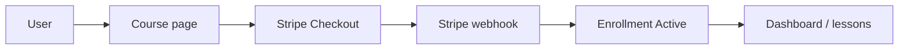

# LMS Platform

A full-stack learning management system built with **Next.js**. It combines a public course catalog, **Stripe**-powered enrollment, a student learning experience with progress tracking, and an **admin** area for authoring courses (chapters, lessons, rich text, and media uploads to **S3-compatible** storage).

---

## Features

### Learners

- Browse the public course catalog and open course detail pages.
- Enroll via **Stripe Checkout**; enrollment is activated after successful payment through the Stripe webhook.
- **Dashboard**: view enrolled courses with progress, and discover courses you have not taken yet.
- **Course player**: chapter and lesson navigation, lesson content, and **mark lesson as completed** (persisted per user).

### Admin and course authors

- **Role-based access**: users with `role === "admin"` access `/admin`; others are redirected to `/not-admin`.
- **Admin home**: overview metrics, enrollment trends (**Recharts**), and recent courses.
- **Course management**: create and edit courses; manage **chapters** and **lessons** with **drag-and-drop** reordering.
- **Rich text** descriptions (**TipTap**).
- **Course status**: `Draft`, `Published`, or `Archive`.
- **Media**: course thumbnails and lesson video/thumbnail uploads via **presigned URLs** to an S3-compatible bucket.

### Authentication and security

- **Better Auth** with the Prisma adapter: **GitHub OAuth** and **email OTP** (delivered through **Resend**), plus the **admin** plugin.
- **Arcjet** for application protection (e.g. shield rules and rate limits on sensitive flows such as enrollment and file upload).
- **Environment validation** with `@t3-oss/env-nextjs` and **Zod** so misconfiguration fails fast at runtime.

### Payments

- **Stripe** webhook handles `checkout.session.completed` and sets the corresponding enrollment to **Active**.
- Dedicated **success** and **cancel** routes under `/payment`.

---

## Tech stack

| Area | Technologies |
|------|----------------|
| Framework | Next.js 16 (App Router), React 19, TypeScript |
| UI | Tailwind CSS 4, Radix UI / shadcn-style components, Lucide & Tabler icons, `next-themes`, Sonner |
| Data | Prisma 7, PostgreSQL (`@prisma/adapter-pg`), generated client under `src/app/generated/prisma` |
| Auth | better-auth (GitHub + email OTP + admin plugin) |
| Payments | Stripe |
| Email | Resend |
| Storage | AWS SDK for JavaScript v3 (S3-compatible API, presigned uploads) |
| Protection | Arcjet |
| Forms & validation | react-hook-form, Zod |
| Editor | TipTap |
| Tables & charts | TanStack React Table, Recharts |
| Drag and drop | dnd-kit |

---

## Enrollment flow



---

## Prerequisites

- **Node.js** 20 LTS (or another current LTS you use locally).
- **PostgreSQL** and a `DATABASE_URL` connection string.
- Accounts and credentials for: **Stripe** (including webhook signing secret), **Resend**, **GitHub OAuth** app, **Arcjet**, and an **S3-compatible** object store (plus IAM endpoint if your provider requires it).

---

## Environment variables

Values are validated in [`src/lib/env.ts`](src/lib/env.ts). Copy [`.env.example`](.env.example) to `.env` and fill in real values.

| Variable | Scope | Description |
|----------|--------|-------------|
| `DATABASE_URL` | Server | PostgreSQL connection URL |
| `BETTER_AUTH_SECRET` | Server | Secret for Better Auth session signing |
| `BETTER_AUTH_URL` | Server | Canonical origin of the app (e.g. `http://localhost:3000` in dev) |
| `AUTH_GITHUB_CLIENT_ID` | Server | GitHub OAuth client ID |
| `AUTH_GITHUB_CLIENT_SECRET` | Server | GitHub OAuth client secret |
| `RESEND_API_KEY` | Server | Resend API key for transactional email / OTP |
| `ARCJET_KEY` | Server | Arcjet API key |
| `ARCJET_ENV` | Server | Arcjet environment identifier |
| `AWS_ACCESS_KEY_ID` | Server | S3-compatible access key |
| `AWS_SECRET_ACCESS_KEY` | Server | S3-compatible secret key |
| `AWS_REGION` | Server | Region (or provider-specific region string) |
| `AWS_ENDPOINT_URL_S3` | Server | S3 API endpoint URL |
| `AWS_ENDPOINT_URL_IAM` | Server | IAM API endpoint URL (required by this project’s env schema) |
| `STRIPE_SECRET_KEY` | Server | Stripe secret API key |
| `STRIPE_WEBHOOK_SECRET` | Server | Signing secret for `/api/webhook/stripe` |
| `NEXT_PUBLIC_AWS_BUCKET_NAME` | Client | Bucket name for uploads and public asset URLs |

**Stripe**: register the webhook endpoint `https://<your-domain>/api/webhook/stripe` (use the Stripe CLI or dashboard for local testing).

**Better Auth**: `BETTER_AUTH_URL` must match how users reach your app (scheme + host + port).

---

## Getting started

```bash
git clone <your-repo-url>
cd lms-platform
pnpm install
cp .env.example .env
# Edit .env with your secrets and URLs

pnpm exec prisma migrate dev
pnpm dev
```

Open [http://localhost:3000](http://localhost:3000).

### Scripts

| Command | Description |
|---------|-------------|
| `pnpm dev` | Start Next.js in development mode |
| `pnpm build` | Production build |
| `pnpm start` | Run production server |
| `postinstall` | Runs `prisma generate` after install |

---

## Admin access (development)

The repository includes a server action that toggles the signed-in user between `user` and `admin` roles (`src/actions/changeRole.ts`). Treat this as a **development convenience** only. For production, provision admins through a secure, audited process rather than a self-serve toggle.

---

## License

Specify your license here (for example MIT, Apache-2.0, or proprietary). Add a `LICENSE` file in the repository root when you choose one.

---

## Contributing

Contributions are welcome: open an issue to discuss larger changes, or submit a pull request with a clear description of the behavior and any new environment variables.
